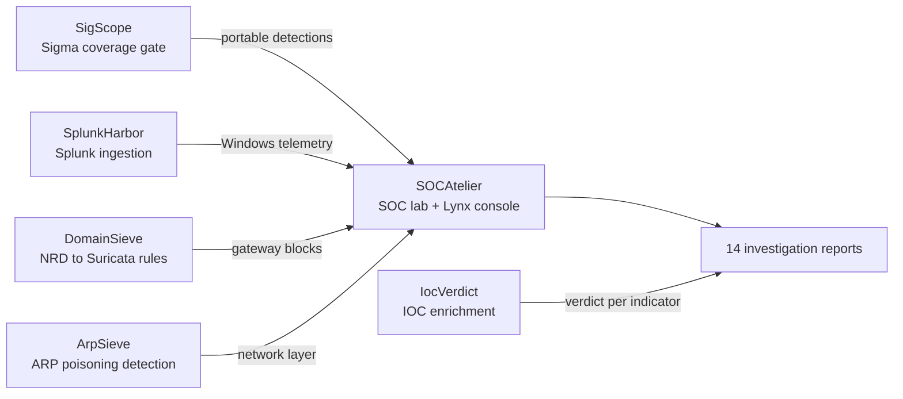

# Boluwaji Oluwaseyi Adepoju

Cybersecurity student building a home SOC end to end. The six repositories
below are one system: the same telemetry flows from ingestion to detection
to triage to a written report.

## The stack

| Repo | What it is | CI |
| --- | --- | --- |
| [SOCAtelier](https://github.com/boluwajioadepojuw/SOCAtelier) | Home SOC lab: Elastic + Suricata + Sysmon, Lynx console (FastAPI + React), 97 detection rules, 14 investigation reports |  |
| [SigScope](https://github.com/boluwajioadepojuw/SigScope) | Sigma-to-ATT&CK coverage gate that fails CI when coverage drops; Navigator layer export |  |
| [SplunkHarbor](https://github.com/boluwajioadepojuw/SplunkHarbor) | Splunk lab: ingestion, index routing, five SPL detections as saved searches with webhook alerting |  |
| [IocVerdict](https://github.com/boluwajioadepojuw/IocVerdict) | IOC enrichment console: six free sources, 0-100 scoring, MITRE mapping |  |
| [DomainSieve](https://github.com/boluwajioadepojuw/DomainSieve) | NRD feed to Suricata rules: brand impersonation domains become gateway blocks |  |
| [ArpSieve](https://github.com/boluwajioadepojuw/ArpSieve) | ARP spoofing detector, live and pcap, with sample captures as test fixtures |  |

## The L1 loop

Detect (SigScope rules, SOCAtelier profiles) -> ingest (SplunkHarbor,
Suricata, Sysmon) -> triage (Lynx console) -> enrich (IocVerdict,
DomainSieve, ArpSieve) -> respond (actions, osTicket) -> write up
(investigation reports).

## Working principles

- Every lab run is a controlled simulation; the Linux cases are live on
  the lab machine, the Windows cases are archived replays - each report
  says which.
- Deterministic where it matters: the console and the phishing analyzer
  work fully offline, no AI service required.
- Detection as code: CI gates rule coverage, lint and build the console,
  and validates the Splunk configs before anything merges.
